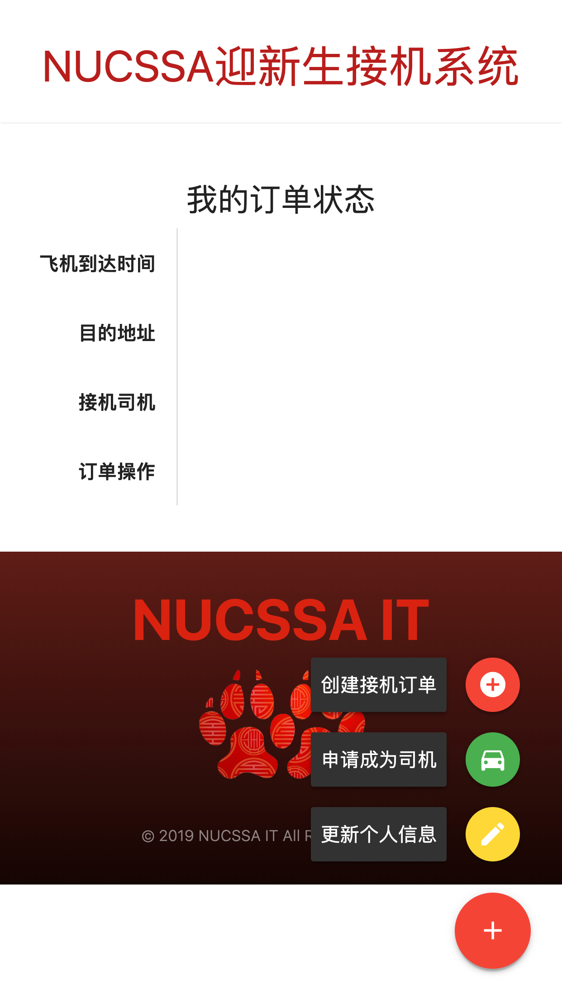

### Screenshots
#### Admin Dashboard (司机审核、新生审核)


#### 创建订单



#### 司机报名


#### 司机抢单


#### 司机查看自己抢到的订单


#### 其他截图


### Installation Instructions
0. Install this plugin to `$WordPress$/wp-content/plugins` directory
1. This plugin requires `nucssa-core` to perform properly
2. Admin users need to have capacility of `manage_pickups` to see the admin dashboard pages
3. Need to define the following constants in `wp-config.php`:
```php
/**
 * SendGrid Mailing Relay Configurations
 */
define('PICKUP_ADMIN_EMAIL', 'xxx');
define('SENDGRID_SMTP_HOST', 'xxx');
define('SENDGRID_SMTP_PORT', xxx);
define('SENDGRID_SMTP_USERNAME', 'xxx');
define('SENDGRID_API_KEY', 'xxx');
define('SENDGRID_SMTP_SECURE', 'TLS');
```